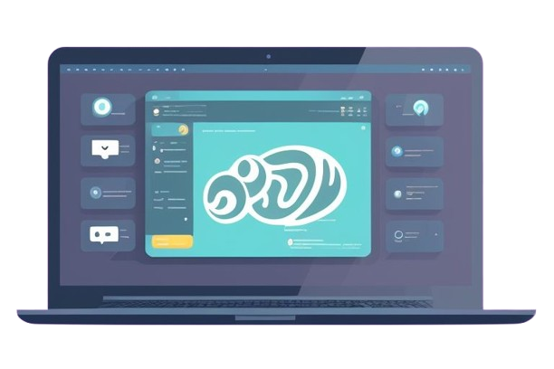
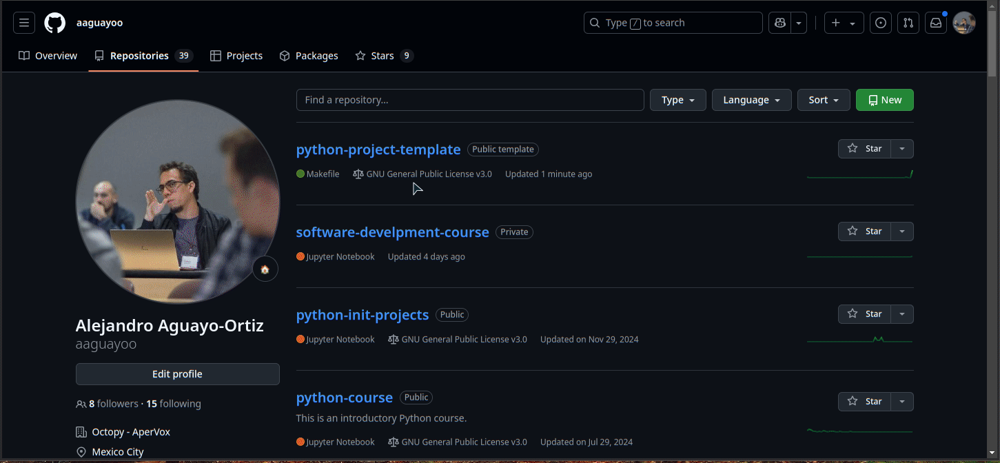

# Python Project Template

Author: [Alejandro Aguayo-Ortiz](mailto:aaguayoo92@gmail.com)

Version: **v0.2.0**

---

This Cookiecutter template allows you to quickly create Python projects ready to be
installed with Pip or Poetry. It includes a basic structure of `.py` files, as well as
initial documentation and code cleanliness standards. Additionally, it provides a
preconfigured Makefile to efficiently manage simple commands to use the template. Ideal
for develop Python packages/modules with a solid and uniform foundation.

---

## Requirements

In order to use this repository as a Python project template, you must have installed in
your system the following Python packages:

- Python (^3.10)
- cookiecutter (^2.6.0)
- poetry (^1.8.2)

Additionaly, you must have installed the Unix command:

- make (^3.81)

General use of this template and the repository generated from it requires direct
handling of commands in the terminal. Therefore, it is advisable to always have at least
one terminal open along with the code editor of your choice.

---

## Using as Github template

1. Click the big green button `Use this template` or click <a href="../../generate">here</a>.
2. Enter a Repository name and click `Create repository from template`.
3. Head over to the created repository and complete the setup.

### Complete setup

1. Go to <a href="../../settings/actions">Settings/Actions</a> and, in the "Workflow permissions" section, mark _Read and write permissions_ and _Allow GitHub Actions to create and approve pull requests_.
2. In the new repository, <a href="../../edit/develop/cookiecutter.json">complete the project setup</a> by editing the `cookiecutter.json` file, with the name of the package (project), module, description and authors.
3. Commit your changes.
4. Wait <a href="../../actions">Setup Repository Action</a> to complete.
5. Finally Re-Run the action workflow.



---

## Using as local template

To use this repo as template follow these steps:

1. Create your own repository:

    - In local:
        ```bash
        user@host$ mkdir <git_reponame>
        user@host$ cd <git_reponame>
        user@host$ git init
        ```

    - In git:
        1. Create new EMPTY repository.
        2. Clone repository:
            ```bash
            user@host$ git clone git@github.com:<git_username>/<git_reponame>.git
            ```
        3. Enter directory:
            ```bash
            user@host$ cd <git_reponame>
            ```

2. Enter your repository and follow this steps:
    1. Exit the directory of your repository and clone this one:
        ```bash
        user@host$ git clone git@github.com:aaguayoo/python-project-template.git
        ```

    2. Enter to your repo directory:
        ```bash
        user@host$ cd <git_reponame>
        ```

    3. Copy all the necessary files from the `python-project-template` to your repo:
        ```bash
        user@host$ rsync -av /path/to/python-project-template/ . --exclude=.*/
        ```

3. Start [Cookiecutter](https://www.cookiecutter.io/) by running:
    ```bash
    user@host$ make
    ```

4. Follow the Cookiecutter steps by defining:
    - git username [`git_username`]: The username associated with your
    git account (e.g., *aaguayoo*).
    - git repository name [`git_reponame`]: The name given to the project
    repository while creating it (e.g., *awesome-project*).
    - Author [`author`]: Author's full name. Default value obtained from
    `git_username` (e.g., *Alejandro Aguayo Ortiz*).
    - Email [`email`]: Email associated with git account. Default value obtained from
    `git_username` (e.g., *aaguayoo92@gmail.com*).
    - Project Name [`project_name`]: The full name given to the project. Default value
    obtained from `git_reponame` (e.g., *Awesome Project*).
    - Project Slug [`project_slug`]: Name given to the project's main directory and, therefore,
    to the Python package object. Default value obtained from `project_name` with a format
    that follows the [PEP8 standards](https://peps.python.org/pep-0008/#package-and-module-names)
    for modules and directories (e.g., *awesome_project*).
    - Description [`description`]: A brief description of the project.

5. When the Cookiecutter finishes, you will find the following file structure:
    ```
    |- <project_slug>/:
        |
        |- .gitignore
        |
        |- .pre-commit-config.yaml
        |
        |- Makefile
        |
        |- README.md
        |
        |- docs/:
        |   |
        |   |- design_doc.md
        |   |- examples.md
        |   |- img/
        |   |- index.md
        |   |- javascripts/
        |   |- module_reference/
        |   |- profiling_doc.md
        |   |- stylesheets/
        |
        |- notebooks/:
        |
        |- profiling/:
        |   |
        |   |- __init__.py
        |   |- confprofiling.py
        |   |- <project_slug>_profiling.py
        |
        |- pyproject.toml
        |
        |- requirements/:
        |   |
        |   |- common.txt
        |   |- dev.txt
        |   |- prod.txt
        |
        |- tests/:
        |   |
        |   |- __init__.py
        |   |- conftests.py
        |   |- test_<project_slug>.py
        |
        |- <project_slug>/:
            |
            |- __init__.py
            |- constants.py
            |- decorators.py
            |- errors.py
            |- model.py
            |- schemas.py
            |- types.py
            |- warnings.py
            |- utils/
    ```

6. In order to initialize this new repository, you must start the virtual environment.
This can be done using Poetry. Two types of environments can be
deployed: `dev` (default) or `prod`. The `dev` environment installs all the development
dependencies, whilst `prod` installs specific production dependencies.
Both environments install some (common) main dependencies, which are the most important
ones (see pyproject.toml).

7. To start the virtual environment run one of the following commands:
    ```bash
    user@host$ make install
    ```

    Two files are created with all the installed dependencies (poetry.lock) and  configuration for the path to the environment (poetry.toml). Moreover, requirements.txt-pip-like files are saved in the `requierements` directory, in case you want to enable your own Virtualenv environment.

    After this, your terminal prompt must look like:
    ```bash
    (environment) user@host$
    ```

8. Run `pre-commit` using:
    ```bash
    (environment) user@host$ make pre-commit
    ```

    You will see a bunch of fixings and error messages but **DO NOT WORRY**, these are
    perfectly normal. This is how pre-commit works, must of the hooks find issues and fix
    them _in-place_.
    You may have to run this command another time to check the changes performed by the
    reformatters, and this time you will get only green `Passed` messages. This command also runs `git add .`.

9. Then run commit:
    ```bash
    (environment) user@host$ make commit
    ```

10. And finally push your changes into the actual branch.

---

## Using Makefile

- **Help**

    To see all possible Makefile targets, run:
    ```bash
    (environment) user@host$ make
    ``` 
    or
    ```bash
    (environment) user@host$ make help
    ``` 

    You can add your own Makefile targets and include them in the `make help` output by
    following the structure find in the predefined ones.

- **API swagger**:

    This target run a `uvicorn` command to deploy a simple FastAPI implementation of the
    project.
    ```bash
    (environment) user@host$ make api
    ```


- **Change version**[^1]:

    Allows you to change the version of your project throughout all the files that
    contain that information.
    ```bash
    (environment) user@host$ make change_version version=X.X.X
    ```
    where the version number `X.X.X` must follow the [PEP 440 versioning standards](https://peps.python.org/pep-0440).

- **Commit**[^1]:

    You can commit your changes by running:
    ```bash
    (environment) user@host$ make commit
    ```
    This command uses [commitizen](https://commitizen.github.io/cz-cli/), which allows you to create nice,
    well-structured commit messages using the [Conventional Commits](https://www.conventionalcommits.org/en/v1.0.0/)
standards.

- **Documentation**[^1]:

    In the `docs/` directory, you will find a set of files that, together with the
    `mkdocs.yml` file, make up a template for your project documentation using
    [MkDocs](https://www.mkdocs.org). The style use for this template is taken from the
    [Mercury library](https://platform.bbva.com/advanced-analytics/tech-doc/mercury/latest/index.html).

    At the moment, it is only possible to deploy the documentation to a localhost, by
    running the following command:
    ```bash
    (environment) user@host$ make doc-serve
    ```
    Although, it is possible to deploy the documentation on a web site (as performed by
    the [Mercury group](https://platform.bbva.com/advanced-analytics/tech-doc/mercury/latest/index.html)).

- **Jupyter**[^1]:

    With the Makefile commands it is also possible to deploy both a Jupyter Lab
    environment:
    ```bash
    (environment) user@host$ make jupyter-lab
    ```
    or Jupyter Notebook:
    ```bash
    (environment) user@host$ make jupyter-notebook
    ```

    _**NOTE**_: The pre-installed version of Jupyter Lab is 3.6.5, which is not updated.
    The reason for choosing this version is due to the many issues that have
    been found in the >=4.x.x versions.

- **Help**[^2]:
    For information about the use of Makefile targets, run:
    ```bash
    user@host$ make help
    ```

- **Poetry Remove**[^3]:

    If you want to remove the Poetry environment, you first have to exit the environment by running the `exit` command, and then use:
    ```bash
    user@host$ make poetry-remove
    ```

- **Pre-Commit**[^1]:

    In order to run pre-commit hooks, run the command:
    ```bash
    (environment) user@host$ make pre-commit
    ```

    _**NOTE**_: It is highly recommended to run this command constantly while you are coding, in order
    to continually update and reformat your code style.

    Below is a summary of the pre-commit hooks pre-installed in the template:

    - `trailing-whitespace`: Check that all lines in all files do not have whitespace at the
    end of the line.
    - `end-of-file-fixer`: Check that all files do not have extra empty lines at the end.
    - `debug-statements`: Check thtat there are no uncommented lines with debug statements.
    - `check-merge-conflict`: Check that there are no files with conflict messages of git
    merging.
    - `name-tests-test`: Check that all the files in the `tests` directory begin with the
    word `test`.
    - `flake8`: Python linter using PEP8 standards.
    - `flake8-isort` and `isort`: Checks possible errors in libraries imports.
    - `flake8-docstrings`: Check that the docstring for classes, methods and functons exist
    and that they meet certain standars.
    - `flake8-print`: Check that there are no uncommented calls to `print`.
    - `black`: Formats files according to pre-established Python standards.
    - `bandit`: Check that there aare no security issues.
    - `mypy`: Check that all function arguments, returns and attributes are correctly typed.
    - `ruff`: Performs slightly deeper code formatting than Black.

    Check the [pre-commit](https://pre-commit.com/hooks.html) page to see all the supported hooks.

- **Profiling**[^1]:

    By running the command:
    ```bash
    (environment) user@host$ make profile
    ```
    you will perform a performance analysis of the `*_profiling.py` file inside the
    `profiling` directory. With this analysis you will obtain a `.log` file with the
    line-by-line memory usage of the `target_profiling_function`. Moreover, you will get
    a PNG figure with a plot measuring the CPU percentage and RAM memory usage over
    time.

- **Relase tag/version**:

    Use the command:
    ```bash
    (environment) user@host$ make tag version=X.X.X
    ```
    so you can release an specific tag/version of your project from the current commit.
    Or simple use:
    ```bash
    (environment) user@host$ make tag
    ```
    for releasing the version indicated at the `pyproject.toml` file.

- **Tests**[^1]:

    If you perform your tests using the following command:
    ```bash
    (environment) user@host$ make test
    ```
    you will also create a `coverage/` folder inside `docs/`, in which you will find,
    among other files, an `index.html` page where you can see in detail the amount of
    code that has been covered by your tests ([Code Coverage](https://www.honeybadger.io/blog/code-test-coverage-python/)).

---

## Installing packages[^2]

In this section you can check the steps to install packages in the repository created
from the template.

### Common main packages

To install new common packages, those that are typically the important dependencies of
the project, use either:
```bash
(environment) user@host$ poetry add <new-package>
```

It is highly recommended to use Poetry, in order to update de `pyproject.toml` file,
   which is the main project configuration file. The pip requirements files (that you
 find in the `requirements` directory), export all the dependencies from the
   `pyproject.toml` file. You can also manually add new packages on the `[tool.poetry.dependencies]` section.

Another advantage of Poetry over just Pip, is that Poetry perform dependencies
resolution with an algorithm that can solve a Sudoku [(not kidding)](https://www.splitgraph.com/blog/poetry-dependency-resolver-sudoku).

### Dev packages

This template has already pre-installed development package, that you can find at the
`[tool.poetry.group.dev.dependencies]` section of the `pyproject.toml`file. If you want
to install new development libraries, you can do it using Poetry:
```bash
(environment) user@host$ poetry add <new-dev-package> --group dev
```

When running the `make` or `make poetry-dev` commands, the `requirements/dev.txt` and
`requirements/common.txt` files will be automatically updated.

### Prod packages

Similar as with the dev packages, you can install specific production packages by
manually adding them in the section `[tool.poetry.group.prod.dependencies]`, or by
running:
```bash
(environment) user@host$ poetry add <new-prod-package> --group prod
```

---

## Help and contributions

If you want to contribute to this repo template, fork the repo and open a Pull Request.
Fill the PR pre-defined template and ask for review.

If you need help setting up the repository, deploying documentation, creating your own
targets in the Makefile or any other issue related to the use of this template, please contact Alejandro Aguayo-Ortiz
[[**aaguayoo92@gmail.com**](mailto:aaguayoo92@gmail.com)].

---

[^1]: These commands MUST be executed inside the Poetry environment, i.e., after init Makefile with `make`.

[^2]: These commands can be executed either inside or outside the Poetry environment, it doesn't matter.

[^3]: These commands MUST be executed outside the Poetry environment.
